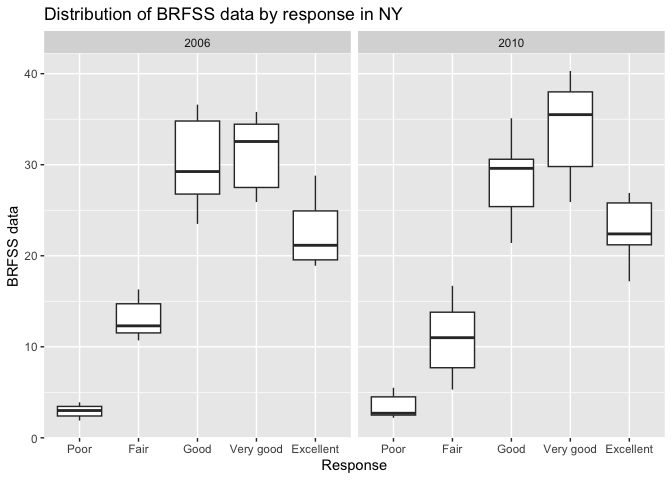
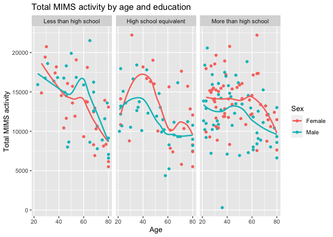
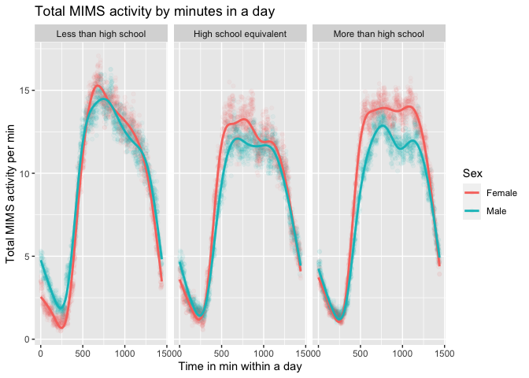

p8105_hw3_sw3879
================
Siqing Wang
2023-10-12

Setting up libraries

``` r
library(tidyverse)
library(ggridges)
library(patchwork)
library(dplyr)
library(ggplot2)
```

## Problem 1

### Loadiing the dataset for Q1

``` r
library(p8105.datasets)
data("instacart")

instacart = instacart |> as.tibble() |> janitor::clean_names()
```

    ## Warning: `as.tibble()` was deprecated in tibble 2.0.0.
    ## ℹ Please use `as_tibble()` instead.
    ## ℹ The signature and semantics have changed, see `?as_tibble`.
    ## This warning is displayed once every 8 hours.
    ## Call `lifecycle::last_lifecycle_warnings()` to see where this warning was
    ## generated.

### Describing the dataset

The `instacart` dataset as 1384617 rows and 15 columns. Important
variables include unique identifier of customer, order time, days since
previous order, and specific information about the product purchased.
There are a total of 131209 orders recorded, and 39123 recorded. These
products range from 21 different departments.

### Answering questions

``` r
instacart |> count(aisle) |> arrange(desc(n))
```

    ## # A tibble: 134 × 2
    ##    aisle                              n
    ##    <chr>                          <int>
    ##  1 fresh vegetables              150609
    ##  2 fresh fruits                  150473
    ##  3 packaged vegetables fruits     78493
    ##  4 yogurt                         55240
    ##  5 packaged cheese                41699
    ##  6 water seltzer sparkling water  36617
    ##  7 milk                           32644
    ##  8 chips pretzels                 31269
    ##  9 soy lactosefree                26240
    ## 10 bread                          23635
    ## # ℹ 124 more rows

There are 134 aisles, and the most ordered items are from fresh
vegetables and fresh fruits.

Making a plot:

``` r
instacart |> count(aisle) |> filter(n > 10000) |> 
  ggplot(aes(x = reorder(aisle, -n), y = n)) + geom_point() +
  theme(axis.text.x = element_text(angle = 45, hjust = 1)) +
  labs(title = "Number of product ordered by aisle",
       x = "Aisle Name", y = "Number of product ordered") 
```

<!-- -->

From this plot, we can see that the 2 most populat aisles are fresh
vetetables and fresh fruits, and these two have significantly more items
ordered than the rest of the aisles.

Making a table of top 3 ordered items from “baking ingredients”, “dog
food care”, “packaged vegetables fruits”:

``` r
instacart |> filter(aisle %in% c("baking ingredients", "dog food care", "packaged vegetables fruits")) |> 
  group_by(aisle) |> count(product_name) |> 
  arrange(desc(n)) |> top_n(n = 3, wt = n) |> 
  rename(times_ordered = n) |> 
  knitr::kable()
```

| aisle                      | product_name                                  | times_ordered |
|:---------------------------|:----------------------------------------------|--------------:|
| packaged vegetables fruits | Organic Baby Spinach                          |          9784 |
| packaged vegetables fruits | Organic Raspberries                           |          5546 |
| packaged vegetables fruits | Organic Blueberries                           |          4966 |
| baking ingredients         | Light Brown Sugar                             |           499 |
| baking ingredients         | Pure Baking Soda                              |           387 |
| baking ingredients         | Cane Sugar                                    |           336 |
| dog food care              | Snack Sticks Chicken & Rice Recipe Dog Treats |            30 |
| dog food care              | Organix Chicken & Brown Rice Recipe           |            28 |
| dog food care              | Small Dog Biscuits                            |            26 |

From the table, we can see that among the three aisles, a lot more items
ordered are from the packaged vegetable and fruit aisle, and the least
items ordered are from the dog food care aisle.

Make a table showing the mean hour of the day at which Pink Lady Apples
and Coffee Ice Cream are ordered on each day of the week:

``` r
instacart |>
  filter(product_name %in% c("Pink Lady Apples", "Coffee Ice Cream")) |>
  group_by(product_name, order_dow) |>
  summarize(mean_hour = mean(order_hour_of_day)) |>
  pivot_wider(
    names_from = order_dow, 
    values_from = mean_hour) |>
  knitr::kable(digits = 2)
```

    ## `summarise()` has grouped output by 'product_name'. You can override using the
    ## `.groups` argument.

| product_name     |     0 |     1 |     2 |     3 |     4 |     5 |     6 |
|:-----------------|------:|------:|------:|------:|------:|------:|------:|
| Coffee Ice Cream | 13.77 | 14.32 | 15.38 | 15.32 | 15.22 | 12.26 | 13.83 |
| Pink Lady Apples | 13.44 | 11.36 | 11.70 | 14.25 | 11.55 | 12.78 | 11.94 |

From the table we can see that on most days, coffee ice cream and pink
lady apples have relative similar sales, but on some days there are more
sales on coffee ice cream than on pink lady apples.

## Problem 2

Load the dataset

``` r
data("brfss_smart2010")
```

Clean data, rename variables, remove unnecessary observations, and
reorder data. Reording is done by making response as a factor then use
it to sort the observations.

``` r
brfss_clean = brfss_smart2010 |> as.tibble() |> 
  janitor::clean_names() |> 
  rename(location_abbr = locationabbr) |> 
  rename(location_desc = locationdesc) |> 
  filter(topic == "Overall Health") |> 
  mutate(response = factor(response, levels = c("Poor", "Fair", "Good", 
                                                "Very good", "Excellent"), 
                           ordered = TRUE)) |> 
  arrange(response)
```

The resulted clean `brfss` dataset has 10625 rows and 23 columns.

In 2002, which states were observed at 7 or more locations? What about
in 2010?

``` r
result_2002 = brfss_clean |> filter(year == "2002") |> 
  group_by(location_abbr) |> 
  summarize(dictinct_loc_count = n_distinct(location_desc)) |> 
  filter(dictinct_loc_count >= 7)
```

``` r
result_2010 = brfss_clean |> filter(year == "2010") |> 
  group_by(location_abbr) |> 
  summarize(dictinct_loc_count = n_distinct(location_desc)) |> 
  filter(dictinct_loc_count >= 7)
```

In 2002, 6 states were observed at 7 or more locations, they are CT, FL,
MA, NC, NJ, PA

In 2010, 14 states were observed at 7 or more locations, they are CA,
CO, FL, MA, MD, NC, NE, NJ, NY, OH, PA, SC, TX, WA

Construct a dataset that is limited to Excellent responses, and
contains, year, state, and a variable that averages the data_value
across locations within a state. Make a “spaghetti” plot of this average
value over time within a state. This is done by first filtering for the
excellent response, selecting out the necessary variables, then
calcualte the average of data value grouped by year and date.

``` r
brfss_excellent = brfss_clean |> 
  filter(response == "Excellent") |> 
  select(c("year", "location_abbr", "data_value")) |> 
  group_by(year, location_abbr) |> 
  mutate(data_value = mean(data_value)) |> 
  distinct() |> 
  rename(state = location_abbr)
```

``` r
brfss_excellent |> 
  ggplot(aes(x = year, y = data_value, group = state, color = as.factor(state))) +
  geom_line() +
  labs(title = "Average BRFSS data per state, 2002 - 2010",
       x = "Year", y = "Average BRFSS data", 
       color = "State")
```

    ## Warning: Removed 3 rows containing missing values (`geom_line()`).

<!-- -->

The `brfss_excellent` dataset has 443 rows and 3 columns.

This spaghetti plot shows BRFSS data for all states from 2002 to 2010.
The mean BRFSS in 2002 is 23.34, and in 2010 is 21.3, so there is a
slight decrease overall.

The state with the lowest average BRFSS data between 2002 and 2010 is
15.99 from the state WV. The state with the highest average BRFSS data
between 2002 and 2010 is 27.43 from the state DC.

Make a two-panel plot showing, for the years 2006, and 2010,
distribution of data_value for responses (“Poor” to “Excellent”) among
locations in NY State. This is done by filtering out rows for 2006 and
2000 and the NY states, then visualize data value with a boxplot to show
distribution in different responses.

``` r
brfss_ny = brfss_clean |> 
  filter(year %in% c("2006", "2010")) |> 
  filter(location_abbr == "NY") |> 
  select(c("year", "location_abbr", "location_desc","response", "data_value"))
```

Making a boxplot to show distribution of response in NY in 2006 and
2010:

``` r
brfss_ny |> ggplot(aes(x = response, y = data_value)) +
  geom_boxplot() +
  labs(title = "Distribution of BRFSS data by response in NY",
       x = "Response", y = "BRFSS data") +
  facet_grid(. ~ year)
```

<!-- -->

In both 2006 and 2010, we can see that the median data for the
`very good` response is the highest, which is 32.55 in 2006 and 35.5 in
2010. We can also see an increase in the median data value for the
`very good` response from 2006 to 2010, while the median data for other
responses stayed similar from 2006 to 2010.

## Problem 3

Load the demographics dataset, recode variable according to csv, remove
\<21 years old, and remove records with any missing data

``` r
demo = read_csv("data/nhanes_covar.csv", skip = 4) |> 
  janitor::clean_names() |> 
  filter(age >= 21) |> 
  mutate(sex = case_match(
    sex, 1 ~ "Male", 2 ~ "Female"),
  sex = as.factor(sex)) |> 
  mutate(education = case_match(
    education, 
    1 ~ "Less than high school", 
    2 ~ "High school equivalent", 
    3 ~ "More than high school"
  ),
  education = factor(education,
                     levels = c("Less than high school", 
                                "High school equivalent",
                                "More than high school"))) |> 
  na.omit()
```

    ## Rows: 250 Columns: 5
    ## ── Column specification ────────────────────────────────────────────────────────
    ## Delimiter: ","
    ## dbl (5): SEQN, sex, age, BMI, education
    ## 
    ## ℹ Use `spec()` to retrieve the full column specification for this data.
    ## ℹ Specify the column types or set `show_col_types = FALSE` to quiet this message.

The demographics dataset has 228 observations after cleaning, and 5
variables. 22 observations were removed. Variables in this dataset
includes .

Load the accelerometer dataset, pivot to long format

``` r
accel = read_csv("data/nhanes_accel.csv") |> 
  janitor::clean_names() |> 
  pivot_longer(
    min1 : min1440,
    names_to = "time_min", 
    names_prefix = "min",
    values_to = "mims_data"
  )
```

    ## Rows: 250 Columns: 1441
    ## ── Column specification ────────────────────────────────────────────────────────
    ## Delimiter: ","
    ## dbl (1441): SEQN, min1, min2, min3, min4, min5, min6, min7, min8, min9, min1...
    ## 
    ## ℹ Use `spec()` to retrieve the full column specification for this data.
    ## ℹ Specify the column types or set `show_col_types = FALSE` to quiet this message.

Merge demo and accel data

``` r
merged_df = left_join(demo, accel, by = "seqn") |> 
  mutate(time_min = as.numeric(time_min))
```

The merged data set has 328320 rows and 5 variables. There are a total
of 228 participants in the dataframe. This dataframe records the MIMS
data for every minute in a day for these participants, along with their
demographic information.

Produce a reader-friendly table for the number of men and women in each
education category, and create a visualization of the age distributions
for men and women in each education category.

``` r
demo |> group_by(education) |> count(sex) |> 
  pivot_wider(
    names_from = sex,
    values_from = n
  ) |> 
  rename(female_number = Female, male_number = Male) |> 
  knitr::kable()
```

| education              | female_number | male_number |
|:-----------------------|--------------:|------------:|
| Less than high school  |            28 |          27 |
| High school equivalent |            23 |          35 |
| More than high school  |            59 |          56 |

``` r
demo |> group_by(education, sex, age) |> 
  ggplot(aes(x = education, y = age, color = sex)) + geom_boxplot() + 
  labs(title = "Demographics by sex and education",
       x = "Education",
       y = "Age",
       color = "Sex")
```

<!-- -->

From the table, we can see that the number of female and male with
education “less than high school” and with “more than high school” are
relatively similar, but more male with “high school equivalent” is
included than female. From the box plot, we can see that the population
with education more than high school is generally younger. The
difference in age between female and male is the most significant in the
high school equivalent education group.

Using your tidied dataset, aggregate across minutes to create a total
activity variable for each participant. Plot these total activities
(y-axis) against age (x-axis); your plot should compare men to women and
have separate panels for each education level. Include a trend line or a
smooth to illustrate differences.

``` r
merged_df |> group_by(seqn) |> 
  summarize(aggre_data = sum(as.numeric(mims_data))) |> 
  right_join(demo) |> 
  ggplot(aes(x = age, y = aggre_data, color = sex)) + 
  geom_point() + geom_smooth(se = FALSE) +
  labs(title = "Total MIMS activity by age and education",
       x = "Age",
       y = "Total MIMS activity",
       color = "Sex") +
  facet_wrap(. ~ education)
```

    ## Joining with `by = join_by(seqn)`
    ## `geom_smooth()` using method = 'loess' and formula = 'y ~ x'

<!-- -->

We can see that there is a general downward trend in total activity as
age increases. This is best evidenced in the less than high school
education group, whereas decrease is slower in the more than high school
group. In the high school equivalent education group, theere is a peak
in activity at ~age = 40. In high school equivalent and more than high
school education group, female generally has higher activity level,
whereas in the less than high school education group there is no such
difference.

Make a three-panel plot that shows the 24-hour activity time courses for
each education level and use color to indicate sex.

``` r
merged_df |> 
  group_by(time_min, education, sex) |> 
  summarize(data_per_min = mean(as.numeric(mims_data))) |> 
  ggplot(aes(x = time_min, y = data_per_min, color = sex)) +
  geom_point(alpha = 0.05) + geom_smooth(se = FALSE) +
  labs(title = "Total MIMS activity by minutes in a day",
       x = "Time in min within a day",
       y = "Total MIMS activity per min",
       color = "Sex") +
  facet_wrap(. ~ education)
```

    ## `summarise()` has grouped output by 'time_min', 'education'. You can override
    ## using the `.groups` argument.
    ## `geom_smooth()` using method = 'gam' and formula = 'y ~ s(x, bs = "cs")'

<!-- -->

Looking at the three panes, we observe similar trends of activity at
different time points within a day, with lowest activity in midnight,
and highest during middle of the day. The lowest MIMS activity point is
at around 0-3, and the highest point is at around 12-15, Similarly, in
high school equivalent and more than high school education group, female
generally has higher activity level than men, especially at the peak
level.
